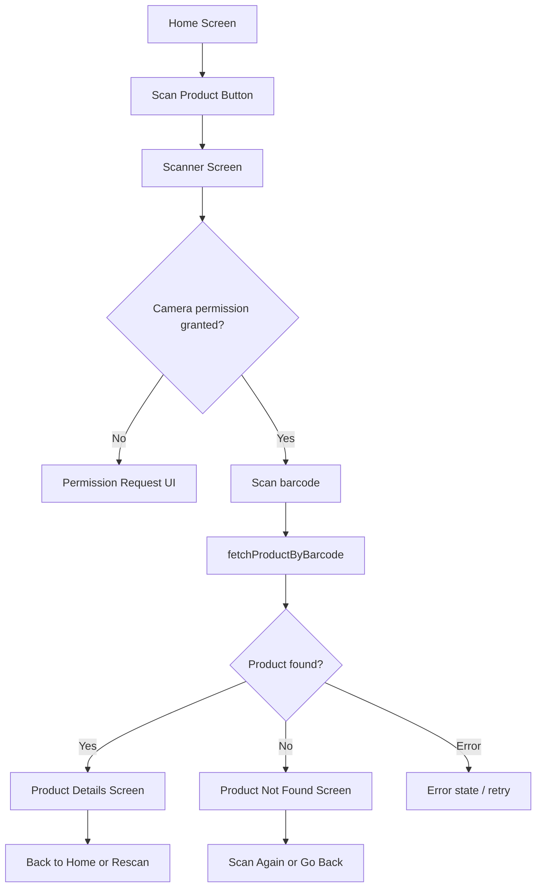
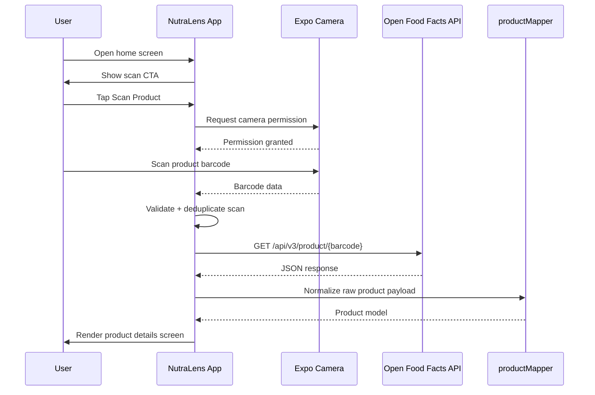

# NutraLens Project Documentation

## Document Purpose

This document consolidates the current implementation knowledge of the NutraLens project based on the repository source, configuration files, and runtime flow as they exist in the workspace. It is intended to serve as a technical and business reference for the current MVP implementation.

---

## 1. Product Overview

Nutralens is a mobile app built with Expo and React Native that allows a user to scan a packaged food barcode and quickly view product metadata and nutrition information sourced from Open Food Facts.

The app is designed around a simple user journey:

1. Open the app.
2. Tap the scan button on the home screen.
3. Allow camera access.
4. Scan a barcode.
5. Fetch product data.
6. View either the product details or a product-not-found state.

The product name and branding in the app are clearly shown as NutraLens, with the brand asset loaded from the custom design folder instead of a generic app icon.

---

## 2. Business Problem It Solves

The application addresses a common consumer problem: packaged food labels often contain nutrition and ingredient information that is difficult to interpret, especially when it is not readily accessible in a quick and structured format.

From the app copy and flow, the product intent is to give users a fast, transparent way to check what is in the food they are buying or consuming, using open community data rather than proprietary scoring systems.

The current MVP does not implement a custom backend, user accounts, or a scoring engine. Instead, it focuses on the core value proposition of:

- instant barcode scanning
- data lookup against a public database
- transparent product identification
- quick access to product information and nutrition facts

This is a lightweight informational app focused on product transparency and decision support.

---

## 3. Target Use Cases

The repository shows the following practical use cases:

### Primary use case: Barcode-based product lookup

A user scans a product barcode while shopping or preparing meals. The app queries Open Food Facts and shows the product details if found.

### Secondary use case: Not-found handling

If the barcode is not present in the database, the app shows a dedicated product-not-found screen with a captured barcode value and actions to scan again or return home.

### Tertiary use case: Nutrition review

Once a product is found, the app displays product metadata and a nutrition section including values such as energy, fat, carbohydrates, sugars, protein, and salt.

### Tertiary use case: Clipboard support

The product-not-found screen includes a copy-to-clipboard action for the scanned barcode.

### Mobile UX use case: Camera access and flash toggling

The scanner screen asks for camera permission, supports front/back camera selection, and includes a flashlight toggle.

---

## 4. How the App Works

### High-level flow



### Runtime behavior

1. The home screen renders the branding and a primary CTA.
2. Pressing the CTA navigates to the scanner route.
3. The scanner screen requests camera permissions if needed.
4. When the camera sees a valid barcode, the `handleBarcodeScanned` callback is triggered.
5. The app checks a `requestInFlightRef` and `lastScannedRef` to avoid duplicate requests and repeated processing.
6. The barcode is passed to `fetchProductByBarcode`.
7. The service requests data from Open Food Facts.
8. The app routes to:
   - `/product/[barcode]` when the product is found
   - `/product-not-found` when no match exists
   - an error state when the lookup fails or the API returns an unexpected schema

---

## 5. Technical Stack

The project is an Expo-managed React Native application using TypeScript.

### Frontend and app framework

- Expo SDK ~57
- React Native 0.86.3
- React 19.2.3
- Expo Router for file-based routing
- TypeScript ~6.0.3

### Key libraries

- `expo-camera` for barcode scanning and camera access
- `expo-router` for navigation and route-based screens
- `expo-symbols` for icon rendering
- `expo-clipboard` for copy-to-clipboard behavior
- `react-native-safe-area-context` for safe area handling
- `expo-status-bar` and `expo-splash-screen` for native shell behavior
- `expo-web-browser` and related Expo packages for app support
- `react-native-reanimated` and gesture-related packages are present in the project dependencies

### App configuration

- `app.json` defines Expo app metadata, Android permissions, and camera plugin settings
- `eas.json` defines EAS build profiles for development, preview, and production builds
- The app uses the `expo-router/entry` entry point (`package.json`)

### Styling and structure

- The app uses React Native `StyleSheet.create` patterns
- Theme constants are centralized in `src/constants/theme.ts`
- Colors, spacing, typography, and palette are defined centrally for consistent UI

---

## 6. Architecture and Routing

### Route structure

The app uses Expo Router with file-based routes:

- `src/app/index.tsx` — home screen
- `src/app/scanner.tsx` — scanner screen
- `src/app/product/[barcode].tsx` — product details screen
- `src/app/product-not-found.tsx` — not-found state
- `src/app/_layout.tsx` — root navigation stack and screen animations

### Navigation pattern

The root layout sets the stack with headerless screens and different animations for screen transitions. In practice, the app navigates via `router.push()` and `router.replace()` depending on whether the user should be able to go back or whether the current flow should replace the stack state.

The code intentionally uses `router.replace()` in the scanner and product flow to avoid stale route states and prevent duplicate back-stack navigation issues.

---

## 7. Product Data and External API

### Data source

The application currently relies on Open Food Facts as the external product source.

### Service layer

The service implementation is located in:

- `src/services/openFoodFacts.ts`

This file contains:

- barcode normalization and validation
- Open Food Facts API endpoint construction
- HTTP fetch logic with timeout handling
- handling for not-found, network, timeout, and server error responses
- response parsing for both v3 and legacy v2-like payloads

### Endpoint used

The current implementation performs a GET request to:

```text
https://world.openfoodfacts.org/api/v3/product/${barcode}?fields=...
```

The `REQUESTED_FIELDS` list includes values such as:

- code
- product name
- brand
- quantity
- serving size
- front image URL
- ingredients
- nutriments
- allergens
- traces
- additives
- categories
- packaging
- origins

### Result model

The normalized product model is defined in:

- `src/types/product.ts`

The result union is:

- `found`: product available
- `not_found`: product missing from the database
- `error`: network/server/parse/timeout issue

---

## 8. Data Normalization and Mapping

### Mapper

The Open Food Facts raw object is converted into the app’s internal product schema in:

- `src/utils/productMapper.ts`

This mapper performs the following tasks:

- extracts the product name with a fallback order
- normalizes the brand, quantity, serving size, and image URL
- cleans ingredients and taxonomies from Open Food Facts labels
- converts allergen, trace, and additive tags into clean display strings
- extracts per-100g nutrition values with explicit null handling

### Nutrition rules

The code explicitly protects against false zero values by only returning numeric zero when the API supplies an actual numeric zero. Missing or undefined nutrient values are treated as `null` rather than `0`.

This is important for accurate display and avoids misreporting absent values as real zero nutrition content.

---

## 9. Screens and UX Flow

### Home screen

File: `src/app/index.tsx`

Responsibilities:

- displays the NutraLens branding
- shows the main hero message
- includes a scan CTA
- explains the three-step flow: scan, fetch, inspect
- displays a footer note that the data comes from Open Food Facts

### Scanner screen

File: `src/app/scanner.tsx`

Responsibilities:

- requests camera permission
- handles barcode detection
- prevents duplicate requests using refs
- locks scanning while the lookup is in flight
- redirects to product or not-found flows after lookup
- supports with flashlight and camera flip actions
- displays loading/error states

### Product details screen

File: `src/app/product/[barcode].tsx`

Responsibilities:

- reads the barcode from route params
- loads the product again via `fetchProductByBarcode`
- renders a product metadata card
- displays nutrition values and related product information
- includes actions for back navigation and rescan flow

### Product-not-found screen

File: `src/app/product-not-found.tsx`

Responsibilities:

- receives the captured barcode via route params
- displays a branded not-found illustration and message
- shows the barcode value
- enables copy-to-clipboard action
- provides “Scan Again” and “Go Back” actions

---

## 10. Design and Branding Assets

The project includes a dedicated design folder under:

- `src/design/stitch_nutralens_mobile_app_ui/`

This folder contains the app design references and screen mockups, including:

- neutral logo asset
- product details mockup
- product not found mockup
- scanner mockup
- home/splash assets

The app uses the approved design logo image at:

- `src/design/stitch_nutralens_mobile_app_ui/nutralens_logo/screen.png`

The shared branding component is:

- `src/components/common/NutraLogo.tsx`

This component loads the design asset as the actual brand logo and renders it consistently across the app.

---

## 11. Theme and UI System

Theme constants are centralized in:

- `src/constants/theme.ts`

This file defines:

- `NutraColors` palette
- `Colors` light/dark modes
- spacing scale
- typography presets
- platform-aware font settings

The design language is a green-and-cream eco/health-friendly palette with strong contrast and readable typography. It is used across the home screen, scan screen, and product-related states.

---

## 12. File-by-File Map

### Root project files

- `package.json` — project dependencies, scripts, and package metadata
- `app.json` — Expo app metadata and plugin configuration
- `eas.json` — EAS build profiles
- `tsconfig.json` — TypeScript configuration
- `README.md` — default Expo starter documentation

### App shell and navigation

- `src/app/_layout.tsx` — root navigation stack and screen options
- `src/app/index.tsx` — home screen
- `src/app/scanner.tsx` — scanner flow
- `src/app/product/[barcode].tsx` — product detail page
- `src/app/product-not-found.tsx` — product-not-found screen

### Shared logic and data

- `src/services/openFoodFacts.ts` — API access and product lookup logic
- `src/utils/barcode.ts` — barcode validation and normalization logic
- `src/utils/productMapper.ts` — API-to-app product normalization
- `src/types/product.ts` — product schema and API response types

### UI helpers and branding

- `src/components/common/NutraLogo.tsx` — shared branded logo component
- `src/constants/theme.ts` — colors, spacing, typography
- `src/global.css` — global CSS entry for the app

### Design and asset references

- `src/design/...` — design assets and mockups used as visual references

---

## 13. Flow Diagram of Data Processing



---

## 14. Build and Deployment Configuration

The EAS build configuration is present in `eas.json` and includes:

- `development` profile with `developmentClient` enabled
- `preview` profile with `distribution: internal`
- `production` profile with `autoIncrement: true`

The Expo app config (`app.json`) includes:

- app name: `Nutralens`
- Android package: `com.mark075.Nutralens`
- camera plugin configuration
- app scheme: `nutralens`
- project ID for EAS

This indicates the project is configured for native builds and mobile distribution through Expo Application Services.

---

## 15. Current MVP Status and Boundaries

Based on the repository contents and the app flow, the current MVP focuses on:

- camera-based barcode scanning
- Open Food Facts lookup
- product detail display
- not-found recovery flow
- branded app UI and design fidelity

The codebase does not currently include the following, at least not as implemented in the repository:

- user authentication
- backend API service for app-specific persistence
- login or user accounts
- recommendation engine
- payment or commerce flow
- product search by text or category
- custom nutrition scoring logic

The app is intentionally a client-side product lookup tool built on open product data.

---

## 16. Summary

Nutralens is a focused mobile product-transparency app that lets a user scan a barcode, check whether a product exists in Open Food Facts, and view a normalized set of information about the item.

The implementation is a lightweight Expo + React Native mobile app with:

- file-based routing
- camera access and barcode scanning
- data normalization and error handling
- branded UX matching the supplied design
- external public-data integration instead of a custom backend

The project is fully aligned with an MVP-style solution for quick product identification and nutrition transparency.

---

## 17. Key Source References

- `src/app/index.tsx`
- `src/app/scanner.tsx`
- `src/app/product/[barcode].tsx`
- `src/app/product-not-found.tsx`
- `src/services/openFoodFacts.ts`
- `src/utils/productMapper.ts`
- `src/types/product.ts`
- `src/constants/theme.ts`
- `src/components/common/NutraLogo.tsx`
- `app.json`
- `eas.json`
- `package.json`
